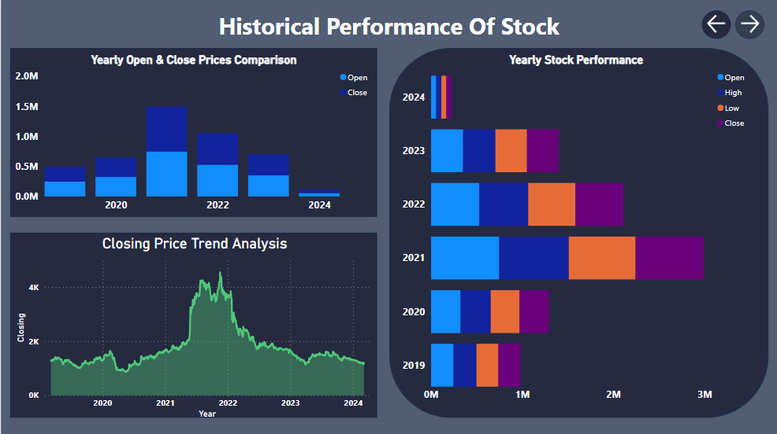

# Lux Industries Historical Data

This repository contains historical data of Lux Industries from Yahoo Finance. Lux Industries Limited is a leading Indian manufacturer, marketer, and exporter of socks, innerwear, and related apparel. The dataset provides historical stock prices and trading volume for Lux Industries, allowing users to analyze and visualize the company's performance over time.

## Comprehensive Time Analysis of Lux Industries Stock Prices

## Opening - Closing Price Trend Analysis

## 5 Years Performance Tracking

## Dataset Overview

The dataset includes the following information:

- Date: The date of the trading day.
- Open: The opening price of Lux Industries stock on the trading day.
- High: The highest price of Lux Industries stock during the trading day.
- Low: The lowest price of Lux Industries stock during the trading day.
- Close: The closing price of Lux Industries stock on the trading day.
- Adj Close: The adjusted closing price of Lux Industries stock on the trading day.
- Volume: The trading volume (number of shares traded) of Lux Industries stock on the trading day.

## Visuals Overview

### Line and Stacked Column Chart

The Line and Stacked Column Chart visualizes Lux industries stock data over time, with years on the X-axis and open and close prices on the Y-axis.

### Grouped Line Charts

The Grouped Line Charts display Lux industries open, high, low, and close prices grouped by year, quarter, month, and day. Each line chart provides insights into the stock's performance over different time intervals.

### Stacked Column Chart

The Stacked Column Chart represents Lux industries open and close prices by year, with years on the X-axis and prices on the Y-axis.

### Table

The Table visualizes Lux industries data, including date, open, high, low, and close prices, allowing for detailed analysis of the stock's historical performance.

### KPI

The KPI visualizes key performance indicators such as sales, revenue, or profit. In this report, the KPI may represent metrics like stock price changes, volume, or other relevant indicators.

### Treemap

The Treemap visualizes Lux industries data hierarchically, allowing users to explore sales or other metrics across different categories such as year, quarter, month, and day.

## Usage

You are free to use this dataset for your analysis, research, or projects. Some potential use cases include:

- Analyzing historical stock price movements of Lux Industries.
- Building predictive models for forecasting Lux Industries stock prices.
- Conducting statistical analysis or generating insights about Lux industries performance.

## How to Use

To use the dataset, simply clone or download this repository to your local machine. The dataset is provided in CSV format, which can be easily imported into various data analysis tools such as Excel, Python, R, or Power BI.
